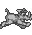
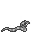
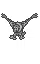
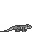

# "The Jungle Book" Disassembly (Game Boy)

This is a disassembly of Game Boy game "The Jungle Book".
Additionally, this repository contains tools to understand and modify the game.

__This project does not promote piracy and requires a copy of the original game to compile.__
For more information see "Building".
Note that this project is still work in progress with contributions being welcome :)

## Building

To avoid problems with copyright, this project just provides some kind of skeleton code without any assets, such as sprites and logos.
In the code, these assets are represented by external dependencies (`INCBIN <path_to_asset>`).
To get everything compiled, you need to extract the assets from an original copy of the game with the following script:
```bash
./utils/asset_extractor jb.sym <path_to_original_copy>
```
This will create a directory `assets` including the subdirectories of `bin` and `gfx`.
Subsequently, copy `bin` and `gfx` to `src`:
```bash
cp -r assets/bin src/bin
cp -r assets/gfx src/gfx
```
Now everything is in place and you can start the compilation using the [RGBDS](https://github.com/gbdev/rgbds) toolchain.
Assuming RGBDS is installed, the game can be compiled with:
```bash
cd  src
make all
```
The compiled game can then be found as `game.gb`.
If you didn't modify the source code of this repository, `game.gb` should be a bit-exact copy of the original game.
This can quickly be verified with an MD5 hash:
```bash
md5sum original_game.gb
md5sum built_game.gb
```
The result should be `e5876720bf10345fb2150db6d68c1cfb`.

## Progress

The project is still work in progress with the following status per file:

| File Name    | Labels identified |
|--------------|-------------------|
| bank_000.asm | 57.1% (323/566)   |
| bank_001.asm | 42.4% (184/434)   |
| bank_002.asm | 100.0% (61/61)    |
| bank_003.asm | 100.0% (40/40)    |
| bank_004.asm | 100.0% (20/20)    |
| bank_005.asm | 100.0% (46/46)    |
| bank_006.asm | 100.0% (26/26)    |
| bank_007.asm | 5.1% (21/408)     |

In total, the progress is 45.0% (721/1601).

## Tools & Assets

### Level Renderer

Initially, this project was started to extract the level maps from the game's ROM.
Because having a map with all gem locations is a significant aid to beat the game and also helps to plan speed runs.
I anticipated there would just be a memory location containing the map indices and map tiles.
It turns out I was wrong as the game uses way too many tricks to cram the 10+2 maps into the 128 kiB of the cartridge.
Nevertheless, after spending way too much time on reverse-engineering decompression algorithms and meta tiles the final product can be found under `utils/level_renderer.py`.
Provide the original game as an argument and execute it as:

```bash
./level_renderer.py <path_to_rom>
```

The maps can then be found in the directory `lr_tmp`.
For instance, the map of the first level looks like this:


### Decompressor

Many assets of the game are LZ77 decompressed.
Use the `decompressor.py` script to decompress the binary data. Optionally, the data can be rendered as tiles.
For example, when decompressing and rendering the font data:

```bash
./decompressor.py CompressedFontTiles.bin
```

You get:


### Object Analyzer

The object analyzer (`utils/object_analyzer.py`) extracts all object data for each level and prints the corresponding attributes.
This includes an object's position, type, the loot it drops, and its X position limits in case the object moves.
Example:

```
Level 1
X pos  Y pos               Type           Loot    X limits
------------------------------------------------------------
   24    408         CHECKPOINT              -           -
 1568    472         CHECKPOINT              -           -
  732    474           CATAPULT              -           -
 3004    474           CATAPULT              -           -
  384    480               BOAR      PINEAPPLE     256-512
  816    480               BOAR      BOOMERANG     752-944
 1488    480               BOAR         GRAPES   1360-1616
  824    256              COBRA        DIAMOND           -
 1112    416              COBRA         SHOVEL           -
 ...
```

### Animation Extractor

The animation extractor (`utils/animation_extractor.py`) extracts frames and animations from the game.
The extracted data is saved as PNGs and GIFs. Examples:








### Symbol File

The file `jb.sym` is a symbol file following the file format from [RGBDS](https://rgbds.gbdev.io/sym).
It can be loaded into many Game Boy tools, such as [Gearboy](https://github.com/drhelius/Gearboy), for an improved debugging experience.